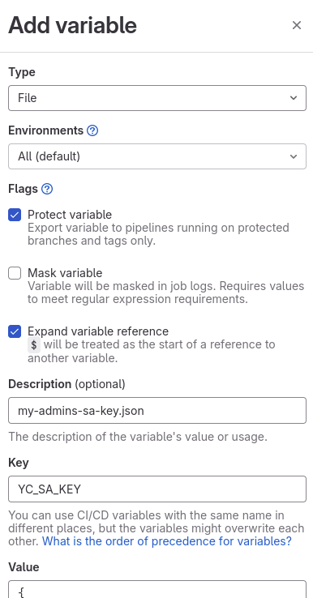
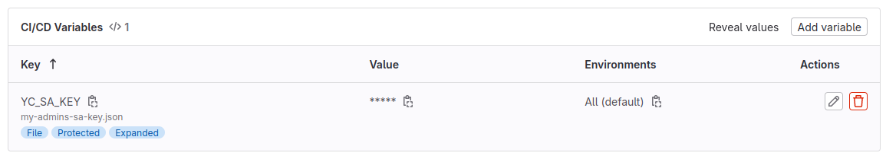
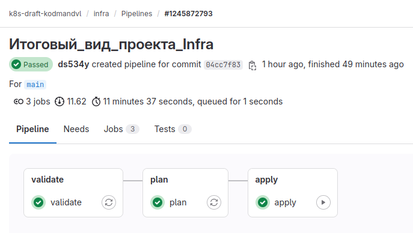

# It's clone (backup) of [my GitLab k8s-draft-kodmandvl/infra repository](https://gitlab.com/k8s-draft-kodmandvl/infra) 

# Проектная работа по курсу "Инфраструктурная платформа на основе Kubernetes"

Это проектная работа по курсу "Инфраструктурная платформа на основе Kubernetes". 

Поскольку инфраструктуру и приложения сопровождают потенциально разные команды, были созданы два отдельных проекта в GitLab: 

- infra (инфраструктура, развёртывание кластера Kubernetes)
- app (приложения, развёртывание наших приложений)

# Тема проектной работы: "Отказоустойчивая конфигурация PostgreSQL на платформе Kubernetes"

## Общие требования к проекту

Развернуть

## Общие требования 1/5 | Функционал

- Kubernetes (managed или self-hosted)
- Мониторинг кластера и приложения с алертами и дашбордами
- Централизованное логирование для кластера и приложений
- CI/CD пайплайн для приложения (Gitlab CI, Github Actions, etc)
- Дополнительно, при необходимости: инфраструктура для трейсинга, хранилище артефактов, хранилище секретов и др.

## Общие требования 2/5 | Оформление

- Автоматизация создания и настройки кластера
- Развертывание и настройки сервисов платформы
- Настройки мониторинга, алерты, дашборды
- CI/CD пайплайн для приложения описан кодом

## Общие требования 3/5 | Доступы

- Публично доступный репозиторий с кодом и пайплайном
- Публично доступный ingress кластера (белый IP, домен)

## Общие требования 4/5 | Документация

- README с описанием решения, changelog
- Шаги развертывания и настройки компонентов
- Описание интеграции с CI/CD-сервисом
- Подход к организации мониторинга и логирования
- Дополнительная информация про вашу платформу

## Общие требования 5/5 | Приложение

Есть два пути: 

1. Наш пример: Sock Shop by Weaveworks
2. Приложение на ваш выбор:
  - Opensource
  - Подходящаяя лицензия (MIT, Apache, etc)
  - Доступно по HTTP
  - Минимум три развертываемых компонента

# Техническое задание (частные требования) для HA-конфигурации PostgreSQL на платформе Kubernetes

Настройка HA-конфигурации PostgreSQL на инфраструктурной платформе Kubernetes является достаточно частным случаем для итоговой проектной работы, но не возбраняется руководителем курса, цитата: 

>> "Берете базу данных и показываете ее отказоустойчивость, ее бэкапы, ее тонкий тюнинг параметров, тюнинг различных балансировщиков для баз данных" 

В силу этой частной специфики, возможно, не все приведённые выше общие требования к проекту будут выполнены. 

Частный набор технических требований, техническое задание, что должно быть реализовано в нашем MVP HA-конфигурации PostgreSQL на платформе Kubernetes: 

- отказоустойчивость СУБД
- резервное копирование БД (и возможность восстановления из него)
- кастомизация СУБД (в т.ч. настройка параметров, расширений, предварительно созданных объектов)
- мониторинг
- балансировка
- UI для СУБД

# Local draft (локальный черновик)

Проработка технической реализации, исследование и эксперименты перед реализацией в Yandex Cloud (чтобы сэкономить денежные средства за аренду вычислительных ресурсов) проводились сначала в локальном кластере Minikube, подробности в [local_draft/README.md](local_draft/README.md) (папка local draft есть как в проекте infra, так и в проекте app). 

Стоит отметить, что в local_draft могут приводиться какие-либо секреты в открытом виде, но это всё используется в локальном кластере-черновике Minikube, который, кроме того, будет уже не существовать к моменту проверки проекта. 

До этого момента README.md в проектах Infra и App одинаковы, а далее они отличаются. 

# Infra

## Кластер Kubernetes

В качестве основы для инфраструктуры взял terraform и Yandex Cloud ([из своего ДЗ по GitOps](https://github.com/otus-kuber-2023-08/kodmandvl_platform/tree/main/kubernetes-gitops)), но в данном проекте решил разбить на отдельные файлы для модульности и удобства дальнейшего сопровождения: 

- сеть
- сервисный аккаунт
- сам кластер
- группа узлов
- и т.д.

* Указывать network_policy_provider не стал, т.к.: 

`network_policy_provider - (Optional) Network policy provider for the cluster. Possible values: CALICO.` 

Calico нам подойдёт. 

* Для группы узлов взяты диски SSD, т.к. для нашего проекта скорость дисков принципиально важна. 

* Для ручного варианта развёртывания managed кластера Kubernetes в Yandex Cloud с помощью terraform есть README.md в папке terraform_and_yc. 

* Для CI/CD пайплайна сделана настройка в .gitlab-ci.yml. 

В terraform_and_yc/README.md при подготовке создается ключ. Его необходимо хранить в безопасном месте. А при использовани CI/CD он должен быть безопасной переменной (один из возможных вариантов): 

My project => Settings => CI/CD => Variables: 

Успешно выполненный [pipeline](https://gitlab.com/k8s-draft-kodmandvl/infra/-/pipelines/1245872793) с джобами terraform validate, plan, apply: 

 

## Объектное хранлище S3 для бэкапов БД

Для хранения бэкапов БД используется S3-хранилище. 

* Для драфт-версии проекта использовался как MinIO (в папке [local_draft/minio](local_draft/minio) размещены соответствующие манифесты), так и S3-хранилище от Yandex Cloud. 

* Для основного проекта использовалось S3-хранилище от Yandex Cloud. 

## Удаление кластера Kubernetes (при необходимости)

Помимо варианта с `terraform destroy`, для полного удаления кластера и созданных вместе с ним terraform-ом объектов представлен скрипт [./manual_destroy/yc_k8s_delete_total.sh](./manual_destroy/yc_k8s_delete_total.sh) ([описание](./manual_destroy/README.md))

## Примечания

* Стоит отметить, что для запуска данного кластера с SSD-дисками необходимо запросить увеличение квоты на общий размер SSD-дисков в Yandex Cloud

* Также в Yandex Cloud необходимо запросить увеличение квоты по количеству Load Balancer-ов (с двух до трех, т.к. в проекте App нам понадобятся 3 Load Balancer-а)

## Дальнейшие планы по развитию проекта Infra

* В случае экономической целесообразности рассмотреть переход от использования S3-хранилища Yandex Cloud к отказоустойчивому S3-хранилищу на основе MinIO в отдельном еще одном кластере Kubernetes (т.к. пример с MinIO в локальном черновике был успешным)

